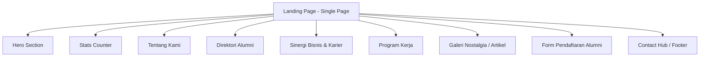
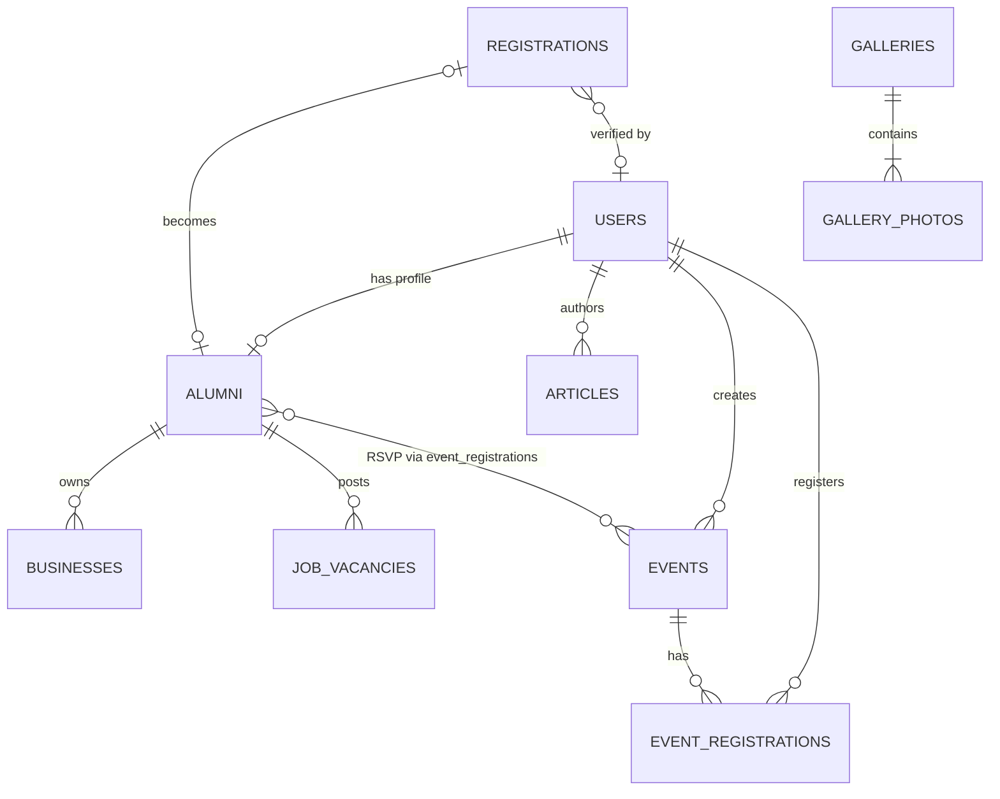

# Product Requirements Document (PRD)
# IKA KPS Balikpapan — Portal Alumni & Manajemen Organisasi

> **Versi:** 1.0  
> **Tanggal:** 8 Oktober 2026  
> **Status:** Draft  
> **Stack:** Laravel 13 · PHP 8.3 · Tailwind CSS 4 · Vite 8 · SQLite

---

## 1. Ringkasan Eksekutif

**IKA KPS Balikpapan** (Ikatan Keluarga Alumni Sekolah Nasional KPS Balikpapan) adalah platform web yang berfungsi sebagai portal resmi alumni, menghubungkan ribuan alumni dari jenjang TK, SD, SMP, dan SMA Nasional KPS Balikpapan lintas generasi. Aplikasi ini bertujuan memfasilitasi silaturahmi, sinergi bisnis, bakti sosial, dan pengelolaan data alumni secara terpusat.

### Visi Produk
Menjadi platform digital utama yang memperkuat ikatan alumni KPS Balikpapan, mendorong kolaborasi profesional dan sosial, serta mendukung kemajuan almamater dan Kota Balikpapan.

### Target Pengguna
| Persona | Deskripsi |
|---------|-----------|
| **Alumni** | Lulusan TK/SD/SMP/SMA KPS dari berbagai angkatan (1970-an hingga sekarang) |
| **Pengurus IKA** | Tim kepengurusan yang mengelola organisasi, program, dan verifikasi data |
| **Admin Sistem** | Pengelola teknis yang memelihara konten, data, dan konfigurasi sistem |
| **Pengunjung Umum** | Calon anggota, mitra bisnis, dan pihak yang tertarik dengan IKA KPS |

---

## 2. Analisis Kondisi Saat Ini (As-Is)

### 2.1 Arsitektur Aplikasi Existing



### 2.2 Model Data Existing

| Model | Tabel | Jumlah Field | Status |
|-------|-------|-------------|--------|
| [User](file:///c:/laragon/www/ika-kps/app/Models/User.php) | `users` | 3 fillable (name, email, password) | Bawaan Laravel, belum digunakan aktif |
| [Alumnus](file:///c:/laragon/www/ika-kps/app/Models/Alumnus.php) | `alumni` | 11 fillable | Read-only tampil di landing page |
| [Business](file:///c:/laragon/www/ika-kps/app/Models/Business.php) | `businesses` | 8 fillable | Read-only tampil di landing page |
| [JobVacancy](file:///c:/laragon/www/ika-kps/app/Models/JobVacancy.php) | `job_vacancies` | 9 fillable | Read-only tampil di landing page |
| [Program](file:///c:/laragon/www/ika-kps/app/Models/Program.php) | `programs` | 9 fillable | Read-only tampil di landing page |
| [Article](file:///c:/laragon/www/ika-kps/app/Models/Article.php) | `articles` | 7 fillable | Read-only tampil di landing page |
| [Registration](file:///c:/laragon/www/ika-kps/app/Models/Registration.php) | `registrations` | 10 fillable | Hanya store (form submit), tidak ada panel verifikasi |

### 2.3 Routes Existing

| Method | URI | Controller | Keterangan |
|--------|-----|-----------|-----------|
| `GET` | `/` | `HomeController@index` | Landing page utama |
| `POST` | `/daftar-alumni` | `RegistrationController@store` | Simpan pendaftaran alumni |

### 2.4 Kelemahan & Gap yang Teridentifikasi

> [!WARNING]
> **Kelemahan Kritis yang Harus Ditangani**

1. **Tidak ada sistem autentikasi** — User model ada tapi belum digunakan, tidak ada login/register
2. **Tidak ada panel admin/dashboard** — Semua data hanya bisa dikelola via seeder/tinker
3. **Tidak ada CRUD operasional** — Data alumni, bisnis, lowongan, program, dan artikel tidak bisa dikelola via UI
4. **Registration tanpa follow-up** — Form pendaftaran tersimpan, tapi tidak ada mekanisme verifikasi/approval
5. **Tidak ada relasi antar model** — Alumni tidak terhubung ke User, Business tidak terhubung ke Alumni
6. **Artikel tanpa konten lengkap** — Hanya summary, tidak ada body content / detail page
7. **Tidak ada pagination** — Semua data di-load sekaligus (`::all()`)
8. **Tidak ada upload file/gambar** — Semua gambar menggunakan URL eksternal
9. **Tidak ada halaman terpisah** — Semua konten tumpuk di satu landing page
10. **Tidak ada event/kegiatan management** — Program kerja hanya informatif, tanpa jadwal event

---

## 3. Kebutuhan Fitur (To-Be)

### 3.1 Sitemap & Struktur Halaman

```mermaid
graph TD
    ROOT["/ (Landing Page)"] --> LP1[Hero + Stats]
    ROOT --> LP2[Tentang Kami]
    ROOT --> LP3[Direktori Alumni Preview]
    ROOT --> LP4[Sinergi Bisnis Preview]
    ROOT --> LP5[Program Kerja Preview]
    ROOT --> LP6[Artikel Preview]
    ROOT --> LP7[Form Pendaftaran]
    ROOT --> LP8[Contact Hub]

    ALUMNI["/alumni (Direktori Alumni)"] --> AL1[Daftar Alumni + Search/Filter + Pagination]
    ALUMNI --> AL2["/alumni/{slug} (Profil Alumni Detail)"]

    BISNIS["/bisnis (Katalog Bisnis)"] --> BI1[Daftar Bisnis Alumni]
    BISNIS --> BI2["/bisnis/{slug} (Detail Bisnis)"]

    KARIER["/karier (Bursa Kerja)"] --> KA1[Daftar Lowongan]
    KARIER --> KA2["/karier/{slug} (Detail Lowongan)"]

    PROGRAM["/program (Program & Kegiatan)"] --> PR1[Daftar Program]
    PROGRAM --> PR2["/program/{slug} (Detail Program)"]

    ARTIKEL["/artikel (Berita & Galeri)"] --> AR1[Daftar Artikel + Filter Kategori]
    ARTIKEL --> AR2["/artikel/{slug} (Detail Artikel)"]

    EVENT["/event (Agenda Kegiatan)"] --> EV1[Kalender Event]
    EVENT --> EV2["/event/{slug} (Detail Event)"]

    AUTH["/login"] --> AU1[Login Form]
    AUTH --> AU2["/register (Registrasi Akun)"]
    AUTH --> AU3["/forgot-password"]

    PROFIL["/profil (Profil Saya)"] --> PF1[Edit Profil]
    PROFIL --> PF2[Riwayat Aktivitas]
    PROFIL --> PF3[Bisnis Saya]

    ADMIN["/admin (Dashboard Admin)"] --> AD1[Dashboard Overview]
    ADMIN --> AD_ALUMNI[Kelola Alumni]
    ADMIN --> AD_REG[Verifikasi Pendaftaran]
    ADMIN --> AD_BIZ[Kelola Bisnis]
    ADMIN --> AD_JOB[Kelola Lowongan]
    ADMIN --> AD_PROG[Kelola Program]
    ADMIN --> AD_ART[Kelola Artikel]
    ADMIN --> AD_EVENT[Kelola Event]
    ADMIN --> AD_USER[Kelola User & Role]
    ADMIN --> AD_SETTINGS[Pengaturan Umum]
    ADMIN --> AD_GALLERY[Kelola Galeri]
    ADMIN --> AD_CONTACT[Pesan Masuk]
```



---

### 3.2 Modul & Fitur Detail

---

#### 📋 MODUL 1: Autentikasi & Profil Pengguna

**Tujuan:** Menyediakan sistem login dan manajemen akun yang aman bagi alumni dan admin.

##### Fitur 1.1: Registrasi Akun Alumni
| Item | Detail |
|------|--------|
| **Deskripsi** | Alumni dapat mendaftar akun melalui form registrasi |
| **Fields** | Nama lengkap, email, password, konfirmasi password, jenjang (TK/SD/SMP/SMA), tahun lulus |
| **Validasi** | Email unik, password min 8 karakter, tahun lulus valid |
| **Alur** | Register → Email verifikasi → Login → Lengkapi Profil |

##### Fitur 1.2: Login & Logout
| Item | Detail |
|------|--------|
| **Deskripsi** | Login standar dengan email & password |
| **Fitur Tambahan** | Remember me, forgot password, reset password via email |
| **Guard** | `web` (default Laravel) |

##### Fitur 1.3: Profil Alumni (Self-Service)
| Item | Detail |
|------|--------|
| **Deskripsi** | Alumni yang sudah login dapat mengelola profil pribadinya |
| **CRUD** | Read (lihat profil), Update (edit profil) |
| **Fields Profil** | Nama, gelar, foto avatar, jenjang, angkatan, profesi, instansi, domisili, bio, tags, media sosial (LinkedIn, Instagram, WhatsApp) |
| **Halaman** | `/profil`, `/profil/edit` |

##### Fitur 1.4: Role & Permission
| Item | Detail |
|------|--------|
| **Roles** | `admin`, `pengurus`, `alumni` (anggota biasa) |
| **Pendekatan** | Gunakan kolom `role` di tabel `users` (simple enum) atau package `spatie/laravel-permission` untuk skalabilitas |
| **Hak Akses** | Admin = full CRUD semua modul; Pengurus = verifikasi pendaftaran + kelola konten; Alumni = edit profil sendiri + submit bisnis/loker |

**Rekomendasi Migrasi Tabel `users`:**
```
users:
  - id
  - name
  - email
  - password
  - role (enum: admin, pengurus, alumni) DEFAULT 'alumni'
  - alumnus_id (FK → alumni, nullable) — relasi 1:1 ke data alumni
  - avatar_url (nullable)
  - phone (nullable)
  - email_verified_at
  - remember_token
  - timestamps
```

---

#### 📋 MODUL 2: Manajemen Alumni (CRUD)

**Tujuan:** Mengelola database alumni secara menyeluruh melalui panel admin.

##### Fitur 2.1: Admin — Daftar Alumni
| Item | Detail |
|------|--------|
| **Halaman** | `/admin/alumni` |
| **Fitur** | Tabel data alumni dengan search, filter (jenjang, angkatan, status verifikasi), sort, pagination |
| **Aksi** | Lihat detail, Edit, Hapus, Toggle verifikasi, Export (CSV/Excel) |

##### Fitur 2.2: Admin — Tambah/Edit Alumni
| Item | Detail |
|------|--------|
| **Halaman** | `/admin/alumni/create`, `/admin/alumni/{id}/edit` |
| **Fields** | Nama, gelar, jenjang, tahun angkatan, profesi, ringkasan, tags (multi-select), badge, lokasi, avatar (upload file), status verifikasi |
| **Validasi** | Nama wajib, jenjang in [tk,sd,smp,sma], tahun angkatan wajib |

##### Fitur 2.3: Admin — Hapus Alumni
| Item | Detail |
|------|--------|
| **Tipe** | Soft delete (tambah `SoftDeletes` trait) |
| **Konfirmasi** | Modal konfirmasi sebelum hapus |

##### Fitur 2.4: Publik — Direktori Alumni (Full Page)
| Item | Detail |
|------|--------|
| **Halaman** | `/alumni` |
| **Fitur** | Pencarian nama/profesi/lokasi, filter jenjang + rentang angkatan, pagination (12 per halaman), card grid layout |
| **Detail** | `/alumni/{slug}` — halaman profil publik alumni individual |

**Rekomendasi Perbaikan Migrasi `alumni`:**
```
alumni (tambahkan):
  - slug (string, unique) — untuk URL friendly
  - phone (nullable) — nomor kontak
  - email (nullable) — email alumni
  - linkedin_url (nullable)
  - instagram_handle (nullable)
  - user_id (FK → users, nullable) — relasi ke akun login
  - deleted_at (softDeletes)
```

---

#### 📋 MODUL 3: Verifikasi Pendaftaran Alumni (CRUD)

**Tujuan:** Mengelola dan memverifikasi pendaftaran alumni baru yang masuk melalui form public.

##### Fitur 3.1: Admin — Daftar Pendaftaran Masuk
| Item | Detail |
|------|--------|
| **Halaman** | `/admin/registrations` |
| **Fitur** | Tabel pendaftaran dengan filter status (pending/verified/rejected), search, sort by tanggal, pagination |
| **Badge** | Notifikasi badge untuk jumlah pending baru |

##### Fitur 3.2: Admin — Detail & Aksi Verifikasi
| Item | Detail |
|------|--------|
| **Halaman** | `/admin/registrations/{id}` |
| **Aksi** | Approve (status → verified, otomatis buat record Alumnus), Reject (status → rejected, kirim alasan), Pending (kembali ke pending) |
| **Automasi** | Saat approve: otomatis create Alumnus baru dari data Registration |

##### Fitur 3.3: Admin — Hapus Pendaftaran
| Item | Detail |
|------|--------|
| **Tipe** | Hard delete / soft delete |
| **Untuk** | Data spam atau duplikat |

**Rekomendasi Perbaikan Migrasi `registrations`:**
```
registrations (tambahkan):
  - rejection_reason (text, nullable)
  - verified_at (timestamp, nullable)
  - verified_by (FK → users, nullable)
  - alumnus_id (FK → alumni, nullable) — relasi ke alumni yang dibuat post-approval
```

---

#### 📋 MODUL 4: Katalog Bisnis Alumni (CRUD)

**Tujuan:** Mendorong sinergi ekonomi antar alumni melalui katalog usaha/UMKM.

##### Fitur 4.1: Admin — CRUD Bisnis
| Item | Detail |
|------|--------|
| **Halaman** | `/admin/businesses`, `/admin/businesses/create`, `/admin/businesses/{id}/edit` |
| **Fields** | Nama usaha, kategori (dropdown), pemilik (relasi ke alumni), deskripsi, foto (upload), tipe aksi (WhatsApp/Phone/Link), link aksi, status (aktif/nonaktif) |
| **Aksi** | Create, Read, Update, Delete, Toggle Aktif/Nonaktif |

##### Fitur 4.2: Alumni — Submit Bisnis Sendiri
| Item | Detail |
|------|--------|
| **Halaman** | `/profil/bisnis/create` |
| **Deskripsi** | Alumni yang login dapat mendaftarkan usahanya sendiri, lalu menunggu approval admin |
| **Status** | Draft → Pending Review → Published / Rejected |

##### Fitur 4.3: Publik — Halaman Katalog Bisnis
| Item | Detail |
|------|--------|
| **Halaman** | `/bisnis` |
| **Fitur** | Grid card bisnis, filter kategori, search, pagination |
| **Detail** | `/bisnis/{slug}` — halaman detail bisnis |

**Rekomendasi Perbaikan Migrasi `businesses`:**
```
businesses (tambahkan):
  - slug (string, unique)
  - alumnus_id (FK → alumni, nullable) — relasi ke pemilik
  - status (enum: draft, pending, published, rejected) DEFAULT 'pending'
  - address (string, nullable)
  - city (string, nullable)
  - phone (string, nullable)
  - whatsapp_number (string, nullable)
  - website_url (string, nullable)
  - deleted_at (softDeletes)
```

---

#### 📋 MODUL 5: Bursa Kerja & Lowongan (CRUD)

**Tujuan:** Memfasilitasi alumni dalam mencari dan berbagi peluang karier.

##### Fitur 5.1: Admin — CRUD Lowongan Kerja
| Item | Detail |
|------|--------|
| **Halaman** | `/admin/job-vacancies`, `/admin/job-vacancies/create`, `/admin/job-vacancies/{id}/edit` |
| **Fields** | Judul posisi, perusahaan, info alumni perusahaan, tipe kerja (Full Time/Part Time/Magang/Freelance), lokasi, range gaji (opsional), deskripsi, persyaratan, link lamaran, deadline, status |
| **Aksi** | Create, Read, Update, Delete, Toggle aktif/expired |

##### Fitur 5.2: Alumni — Submit Lowongan Sendiri
| Item | Detail |
|------|--------|
| **Halaman** | `/profil/lowongan/create` |
| **Deskripsi** | Alumni yang memiliki perusahaan dapat mem-posting lowongan, pending approval admin |

##### Fitur 5.3: Publik — Halaman Bursa Kerja
| Item | Detail |
|------|--------|
| **Halaman** | `/karier` |
| **Fitur** | Daftar lowongan aktif, filter tipe kerja + lokasi, search, pagination |
| **Detail** | `/karier/{slug}` — detail lowongan + tombol lamar |

**Rekomendasi Perbaikan Migrasi `job_vacancies`:**
```
job_vacancies (tambahkan):
  - slug (string, unique)
  - alumnus_id (FK → alumni, nullable) — yang memposting
  - location (string, nullable)
  - salary_range (string, nullable)
  - requirements (text, nullable) — persyaratan
  - deadline (date, nullable)
  - status (enum: draft, pending, active, expired, closed) DEFAULT 'pending'
  - deleted_at (softDeletes)

hapus kolom yang kurang relevan:
  - type_badge_class → sebaiknya generate otomatis dari job_type
  - posted_time_info → gunakan created_at yang sudah ada
```

---

#### 📋 MODUL 6: Program Kerja & Kegiatan (CRUD)

**Tujuan:** Menampilkan dan mengelola program kerja organisasi serta kegiatan bakti sosial.

##### Fitur 6.1: Admin — CRUD Program
| Item | Detail |
|------|--------|
| **Halaman** | `/admin/programs`, `/admin/programs/create`, `/admin/programs/{id}/edit` |
| **Fields** | Judul, deskripsi lengkap, ikon, progress label, persentase progress, achievement text, target dana (opsional), dana terkumpul, status (aktif/selesai/akan datang) |
| **Aksi** | Create, Read, Update, Delete |

##### Fitur 6.2: Publik — Halaman Program
| Item | Detail |
|------|--------|
| **Halaman** | `/program` |
| **Fitur** | Daftar semua program dengan progress bar, filter status |
| **Detail** | `/program/{slug}` — halaman detail program |

**Rekomendasi Perbaikan Migrasi `programs`:**
```
programs (tambahkan):
  - slug (string, unique)
  - body (longText, nullable) — deskripsi panjang/konten
  - target_amount (decimal, nullable) — target dana
  - collected_amount (decimal, nullable) — dana terkumpul
  - status (enum: upcoming, active, completed) DEFAULT 'active'
  - start_date (date, nullable)
  - end_date (date, nullable)
  - image_url (text, nullable)
  - deleted_at (softDeletes)

hapus kolom presentasional:
  - icon_bg_class → generate di view berdasarkan logika
  - bar_color_class → generate di view berdasarkan status
```

---

#### 📋 MODUL 7: Artikel & Berita (CRUD)

**Tujuan:** Mempublikasikan berita, kegiatan, nostalgia, dan prestasi alumni.

##### Fitur 7.1: Admin — CRUD Artikel
| Item | Detail |
|------|--------|
| **Halaman** | `/admin/articles`, `/admin/articles/create`, `/admin/articles/{id}/edit` |
| **Fields** | Judul, slug (auto-generate), kategori (Nostalgia/Kegiatan/Prestasi/Pengumuman), penulis, body (rich text / Markdown), gambar featured (upload), status (draft/published), tanggal publish |
| **Aksi** | Create, Read, Update, Delete, Toggle Draft/Published |

##### Fitur 7.2: Publik — Halaman Daftar Artikel
| Item | Detail |
|------|--------|
| **Halaman** | `/artikel` |
| **Fitur** | Grid artikel, filter kategori, search, pagination, sidebar artikel populer |

##### Fitur 7.3: Publik — Detail Artikel
| Item | Detail |
|------|--------|
| **Halaman** | `/artikel/{slug}` |
| **Fitur** | Konten lengkap, gambar, info penulis, tanggal, kategori badge, artikel terkait, share button |

**Rekomendasi Perbaikan Migrasi `articles`:**
```
articles (tambahkan):
  - body (longText) — konten artikel lengkap
  - author_id (FK → users, nullable) — relasi ke penulis
  - published_at (timestamp, nullable)
  - status (enum: draft, published) DEFAULT 'draft'
  - views_count (integer, default 0) — statistik baca
  - deleted_at (softDeletes)

hapus kolom:
  - badge_bg_class → generate otomatis dari kategori
  - author_and_date → pisah ke author_id + published_at
```

---

#### 📋 MODUL 8: Event & Agenda (BARU)

**Tujuan:** Mengelola jadwal kegiatan, reuni, bakti sosial, dan event lainnya.

##### Fitur 8.1: Admin — CRUD Event
| Item | Detail |
|------|--------|
| **Halaman** | `/admin/events`, `/admin/events/create`, `/admin/events/{id}/edit` |
| **Fields** | Judul, slug, deskripsi, konten, lokasi, tanggal mulai, tanggal selesai, jam, gambar, kategori (Reuni/Baksos/Seminar/Olahraga/Lainnya), status (draft/published/cancelled), max peserta, biaya (opsional) |

##### Fitur 8.2: Publik — Halaman Agenda
| Item | Detail |
|------|--------|
| **Halaman** | `/event` |
| **Fitur** | Kalender event, list view, filter bulan/kategori, pagination |
| **Detail** | `/event/{slug}` — detail event + info pendaftaran |

##### Fitur 8.3: RSVP / Registrasi Event
| Item | Detail |
|------|--------|
| **Deskripsi** | Alumni yang login dapat RSVP/mendaftar mengikuti event |
| **Tabel Baru** | `event_registrations` (event_id, user_id, status, registered_at) |

**Migrasi Baru `events`:**
```
events:
  - id
  - title
  - slug (unique)
  - description (text)
  - body (longText, nullable)
  - location (string)
  - start_date (datetime)
  - end_date (datetime, nullable)
  - category (enum: reuni, baksos, seminar, olahraga, lainnya)
  - image_url (text, nullable)
  - status (enum: draft, published, cancelled) DEFAULT 'draft'
  - max_participants (integer, nullable)
  - fee (decimal, nullable)
  - created_by (FK → users)
  - timestamps
  - softDeletes
```

---

#### 📋 MODUL 9: Galeri Foto (BARU)

**Tujuan:** Menyimpan dan menampilkan dokumentasi foto kegiatan dan nostalgia.

##### Fitur 9.1: Admin — CRUD Album & Foto
| Item | Detail |
|------|--------|
| **Halaman** | `/admin/galleries`, `/admin/galleries/create`, `/admin/galleries/{id}/edit` |
| **Struktur** | Album → Banyak Foto |
| **Fields Album** | Judul, deskripsi, cover image, tanggal, kategori |
| **Fields Foto** | File gambar (upload multi), caption, urutan |

##### Fitur 9.2: Publik — Halaman Galeri
| Item | Detail |
|------|--------|
| **Halaman** | `/galeri` |
| **Fitur** | Grid album, lightbox viewer, filter tahun/kategori |

**Migrasi Baru:**
```
galleries:
  - id
  - title
  - slug (unique)
  - description (text, nullable)
  - cover_image_url (text, nullable)
  - event_date (date, nullable)
  - category (string, nullable)
  - status (enum: draft, published) DEFAULT 'draft'
  - timestamps

gallery_photos:
  - id
  - gallery_id (FK → galleries)
  - image_url (text)
  - caption (string, nullable)
  - sort_order (integer, default 0)
  - timestamps
```

---

#### 📋 MODUL 10: Pesan & Kontak Masuk (BARU)

**Tujuan:** Mengelola pesan masuk dari pengunjung dan saran/ide dari alumni.

##### Fitur 10.1: Publik — Form Kontak
| Item | Detail |
|------|--------|
| **Halaman** | Section di landing page + halaman `/kontak` |
| **Fields** | Nama, email, subjek, pesan |
| **Proteksi** | Honeypot / rate limiting untuk anti-spam |

##### Fitur 10.2: Admin — Inbox Pesan
| Item | Detail |
|------|--------|
| **Halaman** | `/admin/contacts` |
| **Fitur** | Daftar pesan masuk, filter dibaca/belum dibaca, detail pesan, tandai sudah ditangani, hapus |

**Migrasi Baru:**
```
contacts:
  - id
  - name
  - email
  - subject
  - message (text)
  - is_read (boolean, default false)
  - read_at (timestamp, nullable)
  - timestamps
```

---

#### 📋 MODUL 11: Dashboard Admin

**Tujuan:** Memberikan overview terpusat bagi admin untuk memantau dan mengelola seluruh data.

##### Fitur 11.1: Dashboard Overview
| Item | Detail |
|------|--------|
| **Halaman** | `/admin` atau `/admin/dashboard` |
| **Widget** | Total alumni, total pendaftaran pending, total bisnis aktif, total lowongan aktif, total artikel published, total event mendatang |
| **Grafik** | Pertumbuhan alumni per bulan, distribusi jenjang (pie chart), distribusi lokasi alumni |
| **Quick Action** | Verifikasi pendaftaran terbaru, Tambah artikel, Tambah event |

##### Fitur 11.2: Navigasi Admin Sidebar
```
📊 Dashboard
👥 Alumni
   ├── Daftar Alumni
   └── Tambah Alumni
📋 Pendaftaran
   ├── Semua Pendaftaran
   └── Menunggu Verifikasi (badge count)
🏢 Bisnis Alumni
   ├── Katalog Bisnis
   └── Tambah Bisnis
💼 Lowongan Kerja
   ├── Daftar Lowongan
   └── Tambah Lowongan
📰 Artikel & Berita
   ├── Semua Artikel
   └── Tulis Artikel Baru
📅 Event & Agenda
   ├── Daftar Event
   └── Buat Event Baru
🖼️ Galeri Foto
   ├── Album
   └── Upload Foto
🎯 Program Kerja
   ├── Daftar Program
   └── Tambah Program
📬 Pesan Masuk (badge count)
⚙️ Pengaturan
   ├── Profil Admin
   ├── Pengaturan Umum
   └── Manajemen User
```

---

#### 📋 MODUL 12: Pengaturan Umum (BARU)

**Tujuan:** Konfigurasi dinamis untuk konten yang sering berubah tanpa harus edit kode.

##### Fitur 12.1: Pengaturan Website
| Item | Detail |
|------|--------|
| **Halaman** | `/admin/settings` |
| **Konfigurasi** | Nama organisasi, alamat sekretariat, email kontak, nomor WhatsApp, link media sosial (IG/FB/YT/LinkedIn), logo, tagline hero, statistik counter (jumlah alumni, tahun angkatan, dll) |

**Migrasi Baru:**
```
settings:
  - id
  - key (string, unique)
  - value (text, nullable)
  - group (string, default 'general')
  - timestamps
```

---

## 4. Ringkasan Seluruh CRUD Operations

| No | Modul | Create | Read | Update | Delete | Catatan |
|----|-------|--------|------|--------|--------|---------|
| 1 | **Users** | ✅ Register | ✅ Profil | ✅ Edit Profil | ✅ Admin only | + Role management |
| 2 | **Alumni** | ✅ Admin + auto dari Registration | ✅ Publik + Admin | ✅ Admin + Self | ✅ Soft Delete | Inti database |
| 3 | **Registrations** | ✅ Form Publik | ✅ Admin | ✅ Admin (status) | ✅ Admin | Workflow approval |
| 4 | **Businesses** | ✅ Admin + Alumni | ✅ Publik + Admin | ✅ Admin + Owner | ✅ Soft Delete | Approval workflow |
| 5 | **Job Vacancies** | ✅ Admin + Alumni | ✅ Publik + Admin | ✅ Admin + Poster | ✅ Soft Delete | Expire otomatis |
| 6 | **Programs** | ✅ Admin | ✅ Publik + Admin | ✅ Admin | ✅ Soft Delete | Progress tracking |
| 7 | **Articles** | ✅ Admin | ✅ Publik + Admin | ✅ Admin | ✅ Soft Delete | Draft/Published |
| 8 | **Events** | ✅ Admin | ✅ Publik + Admin | ✅ Admin | ✅ Soft Delete | + RSVP |
| 9 | **Galleries** | ✅ Admin | ✅ Publik + Admin | ✅ Admin | ✅ | Multi-upload foto |
| 10 | **Contacts** | ✅ Form Publik | ✅ Admin | ✅ Admin (read status) | ✅ Admin | Inbox system |
| 11 | **Settings** | ✅ Seeder | ✅ Admin | ✅ Admin | ❌ | Key-value config |

---

## 5. Daftar Lengkap Halaman yang Dibutuhkan

### 5.1 Halaman Publik (Guest & Alumni)

| No | Halaman | Route | Deskripsi |
|----|---------|-------|-----------|
| 1 | Landing Page | `GET /` | Homepage dengan semua section preview |
| 2 | Direktori Alumni | `GET /alumni` | Daftar lengkap alumni + pencarian + pagination |
| 3 | Profil Alumni | `GET /alumni/{slug}` | Detail profil alumni individual |
| 4 | Katalog Bisnis | `GET /bisnis` | Daftar usaha alumni + filter kategori |
| 5 | Detail Bisnis | `GET /bisnis/{slug}` | Detail info bisnis alumni |
| 6 | Bursa Kerja | `GET /karier` | Daftar lowongan kerja aktif |
| 7 | Detail Lowongan | `GET /karier/{slug}` | Detail lowongan + tombol lamar |
| 8 | Program Kerja | `GET /program` | Daftar program organisasi |
| 9 | Detail Program | `GET /program/{slug}` | Detail program + progress |
| 10 | Artikel & Berita | `GET /artikel` | Daftar artikel + filter kategori |
| 11 | Detail Artikel | `GET /artikel/{slug}` | Konten lengkap artikel |
| 12 | Agenda Event | `GET /event` | Kalender + daftar event |
| 13 | Detail Event | `GET /event/{slug}` | Detail event + RSVP |
| 14 | Galeri Foto | `GET /galeri` | Grid album foto |
| 15 | Detail Galeri | `GET /galeri/{slug}` | Foto-foto dalam album |
| 16 | Kontak | `GET /kontak` | Form kontak + info sekretariat |
| 17 | Tentang Kami | `GET /tentang` | Halaman profil organisasi lengkap (opsional, bisa tetap section) |

### 5.2 Halaman Autentikasi

| No | Halaman | Route | Deskripsi |
|----|---------|-------|-----------|
| 18 | Login | `GET /login` | Form login |
| 19 | Register | `GET /register` | Form registrasi akun |
| 20 | Forgot Password | `GET /forgot-password` | Form lupa password |
| 21 | Reset Password | `GET /reset-password/{token}` | Form reset password |
| 22 | Verify Email | `GET /verify-email` | Halaman verifikasi email |

### 5.3 Halaman Alumni (Authenticated)

| No | Halaman | Route | Deskripsi |
|----|---------|-------|-----------|
| 23 | Profil Saya | `GET /profil` | Dashboard profil alumni |
| 24 | Edit Profil | `GET /profil/edit` | Form edit profil |
| 25 | Bisnis Saya | `GET /profil/bisnis` | Daftar bisnis yang didaftarkan |
| 26 | Tambah Bisnis | `GET /profil/bisnis/create` | Form daftarkan bisnis baru |
| 27 | Lowongan Saya | `GET /profil/lowongan` | Daftar lowongan yang diposting |
| 28 | Tambah Lowongan | `GET /profil/lowongan/create` | Form posting lowongan baru |

### 5.4 Halaman Admin (Role: admin/pengurus)

| No | Halaman | Route | Deskripsi |
|----|---------|-------|-----------|
| 29 | Dashboard | `GET /admin` | Overview statistik & quick actions |
| 30 | Daftar Alumni | `GET /admin/alumni` | Tabel alumni + CRUD |
| 31 | Tambah Alumni | `GET /admin/alumni/create` | Form tambah alumni |
| 32 | Edit Alumni | `GET /admin/alumni/{id}/edit` | Form edit alumni |
| 33 | Daftar Pendaftaran | `GET /admin/registrations` | Tabel pendaftaran + verifikasi |
| 34 | Detail Pendaftaran | `GET /admin/registrations/{id}` | Detail + aksi approve/reject |
| 35 | Daftar Bisnis | `GET /admin/businesses` | Tabel bisnis + CRUD |
| 36 | Tambah/Edit Bisnis | `GET /admin/businesses/create` & `{id}/edit` | Form CRUD bisnis |
| 37 | Daftar Lowongan | `GET /admin/job-vacancies` | Tabel lowongan + CRUD |
| 38 | Tambah/Edit Lowongan | `GET /admin/job-vacancies/create` & `{id}/edit` | Form CRUD lowongan |
| 39 | Daftar Artikel | `GET /admin/articles` | Tabel artikel + CRUD |
| 40 | Tambah/Edit Artikel | `GET /admin/articles/create` & `{id}/edit` | Form + editor konten |
| 41 | Daftar Event | `GET /admin/events` | Tabel event + CRUD |
| 42 | Tambah/Edit Event | `GET /admin/events/create` & `{id}/edit` | Form CRUD event |
| 43 | Daftar Program | `GET /admin/programs` | Tabel program + CRUD |
| 44 | Tambah/Edit Program | `GET /admin/programs/create` & `{id}/edit` | Form CRUD program |
| 45 | Galeri & Album | `GET /admin/galleries` | Kelola album + upload foto |
| 46 | Pesan Masuk | `GET /admin/contacts` | Inbox pesan + tanda baca |
| 47 | Pengaturan | `GET /admin/settings` | Konfigurasi umum website |
| 48 | Manajemen User | `GET /admin/users` | Kelola akun user + role |

> **Total Halaman: ~48 halaman unik**

---

## 6. Relasi Antar Model (ERD)



---

## 7. Rekomendasi Teknis

### 7.1 Package yang Direkomendasikan

| Package | Kegunaan | Prioritas |
|---------|----------|-----------|
| `laravel/breeze` atau `laravel/fortify` | Scaffolding autentikasi (login, register, reset password, email verify) | 🔴 Tinggi |
| `spatie/laravel-permission` | Manajemen role & permission yang skalabel | 🟡 Sedang (bisa pakai simple enum dulu) |
| `spatie/laravel-medialibrary` | Upload & manajemen file/gambar terpusat | 🟡 Sedang |
| `cviebrock/eloquent-sluggable` | Auto-generate slug untuk model | 🟢 Rendah (bisa manual) |

### 7.2 Prioritas Implementasi (Roadmap)

#### 🔴 Phase 1: Foundation (Sprint 1-2)
1. Setup autentikasi (Breeze/Fortify)
2. Migrasi database: tambah kolom baru + tabel baru
3. Admin layout & dashboard overview
4. CRUD Alumni di admin
5. CRUD & Verifikasi Pendaftaran di admin

#### 🟠 Phase 2: Core Content (Sprint 3-4)
6. CRUD Artikel + halaman detail artikel publik
7. CRUD Program + halaman publik
8. CRUD Bisnis + halaman katalog publik
9. CRUD Lowongan + halaman bursa kerja publik
10. Halaman publik terpisah (direktori alumni, bisnis, karier, artikel)

#### 🟡 Phase 3: Engagement (Sprint 5-6)
11. Profil alumni self-service
12. Submit bisnis & lowongan oleh alumni
13. Event & agenda management + RSVP
14. Galeri foto + upload
15. Pesan masuk / kontak

#### 🟢 Phase 4: Polish (Sprint 7-8)
16. Pengaturan umum (dynamic settings)
17. Pagination di semua halaman list
18. SEO optimization (meta tags per halaman)
19. Export data (CSV/Excel)
20. Notifikasi email (pendaftaran approved, event reminder)

### 7.3 Rekomendasi Non-Fungsional

| Aspek | Rekomendasi |
|-------|-------------|
| **Pagination** | 12 item per halaman untuk card grid, 25 untuk tabel admin |
| **Search** | Full-text search di kolom nama, profesi, lokasi (gunakan `LIKE` untuk MVP, Scout untuk advanced) |
| **File Upload** | Gunakan `storage/app/public` + `php artisan storage:link`, max 2MB per gambar |
| **Caching** | Cache query yang jarang berubah (stats counter, programs) dengan `Cache::remember()` |
| **Soft Delete** | Terapkan di semua model utama (alumni, bisnis, loker, artikel, event, program) |
| **Validation** | Gunakan Form Request class terpisah untuk setiap form |
| **Middleware** | `auth` untuk halaman profil, `auth + role:admin` untuk halaman admin |
| **Mobile** | Pastikan semua halaman baru responsive (sudah baik di landing page existing) |

---

## 8. Kesimpulan

Aplikasi IKA KPS Balikpapan saat ini memiliki **landing page yang sangat solid secara desain**, dengan design system yang matang dan section-section yang komprehensif. Namun, aplikasi ini masih berupa **website informasi statis** tanpa kemampuan manajemen data yang sesungguhnya.

Transformasi utama yang diperlukan adalah:
1. **Dari statis ke dinamis** — admin panel untuk CRUD semua konten
2. **Dari anonim ke terotentikasi** — sistem login & role-based access
3. **Dari single-page ke multi-page** — halaman detail & dedicated pages
4. **Dari manual ke self-service** — alumni bisa kelola profil & submit konten sendiri
5. **Dari one-way ke interactive** — RSVP event, pesan masuk, approval workflow

Dengan implementasi bertahap sesuai roadmap di atas, platform ini akan bertransformasi menjadi **ekosistem digital alumni yang hidup dan berdaya guna** — bukan sekadar website, tapi wadah nyata silaturahmi dan kolaborasi lintas generasi alumni KPS Balikpapan.
