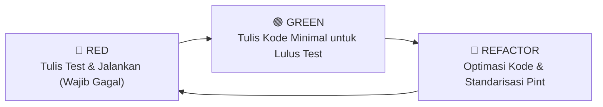

# 🗺️ Master Roadmap & Panduan Eksekusi Fitur
## Portal IKA KPS Balikpapan (Ikatan Keluarga Alumni Sekolah Nasional KPS)

> **Dokumen Panduan Teknis & Roadmap Per-Fitur**  
> **Target Stack:** Laravel 13 · PHP 8.3 · Tailwind CSS 4 · Vite 8 · SQLite  
> **Metodologi Pengembangan:** Test-Driven Development (TDD) — *Red ➔ Green ➔ Refactor*  
> **Standar Kode:** PSR-12, Laravel Best Practices, Laravel Pint Formatter  

---

## 1. Daftar Modul & Urutan Pengerjaan (Roadmap)

Setiap file di dalam folder `task/` adalah panduan teknis mandiri yang mencakup: spesifikasi fitur, migration, seeder realistis, model factory, serta skenario pengujian TDD secara mendalam.

| Fase | File Task | Modul / Fitur | Estimasi Kompleksitas | Ketergantungan (Prasyarat) |
| :--- | :--- | :--- | :---: | :--- |
| **Fase 1: Foundation** | [`01-autentikasi-dan-profil.md`](file:///c:/laragon/www/ika-kps/task/01-autentikasi-dan-profil.md) | Autentikasi & Registrasi Alumni Terpadu ✅ | Selesai | - |
| | [`02-manajemen-alumni.md`](file:///c:/laragon/www/ika-kps/task/02-manajemen-alumni.md) | Direktori & Manajemen Alumni (CRUD + Slug) ✅ | Selesai | Task 01 |
| | [`03-verifikasi-pendaftaran.md`](file:///c:/laragon/www/ika-kps/task/03-verifikasi-pendaftaran.md) | Verifikasi & Persetujuan Keanggotaan Alumni ✅ | Selesai | Task 01, Task 02 |
| | [`11-dashboard-admin.md`](file:///c:/laragon/www/ika-kps/task/11-dashboard-admin.md) | Admin Shell, Layout Sidebar & Ringkasan Metrik ✅ | Selesai | Task 01 |
| **Fase 2: Core Content** | [`04-katalog-bisnis.md`](file:///c:/laragon/www/ika-kps/task/04-katalog-bisnis.md) | Katalog Bisnis Alumni & Pengajuan Mandiri ✅ | Selesai | Task 01, Task 02 |
| | [`05-bursa-kerja.md`](file:///c:/laragon/www/ika-kps/task/05-bursa-kerja.md) | Bursa Kerja (Loker) & Pengajuan Karir ✅ | Selesai | Task 01, Task 02 |
| | [`06-program-kegiatan.md`](file:///c:/laragon/www/ika-kps/task/06-program-kegiatan.md) | Program Kerja Organisasi & Progress Donasi ✅ | Selesai | Task 01 |
| | [`07-artikel-dan-berita.md`](file:///c:/laragon/www/ika-kps/task/07-artikel-dan-berita.md) | Berita, Artikel Nostalgia & Liputan Acara ✅ | Selesai | Task 01 |
| **Fase 3: Engagement** | [`08-event-dan-agenda.md`](file:///c:/laragon/www/ika-kps/task/08-event-dan-agenda.md) | Agenda Kegiatan, Reuni & RSVP Online ✅ | Selesai | Task 01, Task 02 |
| | [`09-galeri-foto.md`](file:///c:/laragon/www/ika-kps/task/09-galeri-foto.md) | Dokumentasi Galeri Foto & Album Kenangan ✅ | Selesai | Task 01 |
| | [`10-pesan-dan-kontak.md`](file:///c:/laragon/www/ika-kps/task/10-pesan-dan-kontak.md) | Hub Kontak & Inbox Pesan Masuk ✅ | Selesai | - |
| **Fase 4: Management** | [`12-pengaturan-umum.md`](file:///c:/laragon/www/ika-kps/task/12-pengaturan-umum.md) | Konfigurasi Dinamis Website & Media Sosial ✅ | Selesai | Task 01 |

---

## 2. Standar Alur Kerja Test-Driven Development (TDD)

Setiap pengerjaan fitur **WAJIB** menerapkan prinsip siklus TDD:



### Langkah Praktis Setiap Task:
1. **Buat Test Terlebih Dahulu**:
   ```bash
   php artisan make:test --phpunit Feature/NamaFiturTest
   ```
2. **Definisikan Skenario Uji**:
   - Status kode HTTP (`assertStatus`, `assertRedirect`, `assertForbidden`).
   - Validasi input (`assertSessionHasErrors`).
   - Perubahan basis data (`assertDatabaseHas`, `assertSoftDeleted`).
   - Konten tampilan (`assertSee`, `assertDontSee`).
3. **Jalankan Test (Harus Gagal / Red)**:
   ```bash
   php artisan test --filter=NamaFiturTest --compact
   ```
4. **Implementasikan Kode Fitur (Green)**:
   - Sesuaikan file migrasi dasar tabel terkait (jangan buat migrasi baru `add_to_...`), jalankan `php artisan migrate:fresh --seed`.
   - Perbarui Model, relasi, cast, dan model factory.
   - Buat Form Request class untuk validasi bersih.
   - Buat Controller & Route.
   - Buat Blade view template.
5. **Jalankan Test Ulang (Harus Lolos / Green)**.
6. **Refactor & Formatting (Refactor)**:
   - Bersihkan duplikasi kode dan query N+1.
   - Jalankan pemformat kode Laravel Pint:
     ```bash
     vendor/bin/pint --dirty --format agent
     ```

---

## 3. Aturan Baku Migration & Seeder (PENTING)

> [!WARNING]
> **DILARANG MENGGUNAKAN MIGRASI `add_to_nama_tabel`**:
> Jangan membuat file migrasi tambahan baru seperti `add_xxx_to_table_name` karena akan menumpuk file migrasi.
> Setiap kali ada penambahan atau modifikasi kolom:
> 1. **Edit langsung file migrasi dasar pembuatan tabel (`create_..._table`)**.
> 2. Jalankan `php artisan migrate:fresh --seed` (atau `php artisan migrate:fresh`).
> 3. Semua tabel inti menerapkan index dan softDeletes secara langsung di file create table masing-masing.

1. **Prinsip Data Keanggotaan**:
   - Organisasi **tidak memiliki basis data arsip lama**, sehingga data alumni bersumber 100% dari pendaftaran mandiri alumni baru.
   - Pendaftaran akun login (`users`) dan profil alumni (`alumni`) disatukan dalam satu formulir (Single Entry).
   - Tabel `registrations` dihilangkan sepenuhnya dari arsitektur.
2. **Seeder & Factory**:
   - Buat Factory untuk setiap Model agar pengujian di TDD mudah dan bersih (`Model::factory()->create()`).
   - Gunakan data realistis bertema Kota Balikpapan dan alumni Sekolah Nasional KPS (jenjang TK, SD, SMP, SMA KPS Balikpapan).
   - Seluruh seeder didaftarkan dan dijalankan di `database/seeders/DatabaseSeeder.php`.

---

## 4. Struktur Direktori Task

```
task/
├── 00-roadmap-overview.md           <-- Anda berada di sini
├── 01-autentikasi-dan-profil.md
├── 02-manajemen-alumni.md
├── 03-verifikasi-pendaftaran.md
├── 04-katalog-bisnis.md
├── 05-bursa-kerja.md
├── 06-program-kegiatan.md
├── 07-artikel-dan-berita.md
├── 08-event-dan-agenda.md
├── 09-galeri-foto.md
├── 10-pesan-dan-kontak.md
├── 11-dashboard-admin.md
└── 12-pengaturan-umum.md
```
